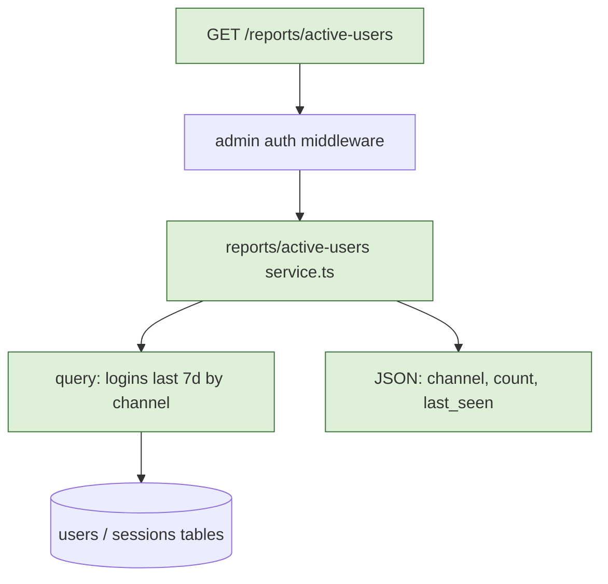

# plan-feature

Most failed AI-coding sessions don't fail because the model is incapable. They fail because the human didn't give it enough context. This skill turns the user into Claude's product manager for ~15 minutes before any code gets written, dramatically increasing the success rate of the actual implementation.

The output is a `plan.md` file that captures everything a competent engineer would need to ship the feature without ambiguity — including a diagram of the proposed design, because an implementer grasps the intended shape far faster from a picture than from a prose description.

## When to use

Use whenever the user asks to build something non-trivial. Triggers include:

- "Add a feature for X"
- "Build / implement / create / ship X"
- "I want to add X to the app"
- "Let's do X"
- Any prompt that names a feature without giving a file path

Do not use for: typo fixes, single-line config changes, simple renames, or when the user has already provided a complete spec.

## The eight-step workflow

Follow these in order. Stop at the user-approval step before drafting code.

### Step 1 — Clarify the goal

Ask the user, in 1-3 questions:

- Who is the user / consumer of this feature? (internal team, end user, system)
- What does "done" look like? (one or two sentences)
- Are there constraints already known? (deadlines, tech stack, must-not-touch areas)

Do not move on until you have a one-paragraph problem statement that the user has confirmed.

### Step 2 — Explore the codebase

Look around before designing. Use Read, Grep, and Glob to:

- Find the directory likely to host the new code
- Identify 1-2 existing features that are structurally similar (these will be the patterns to follow)
- Note conventions: naming, file layout, test framework, error-handling style
- Identify shared utilities the feature will likely reuse
- Identify the boundaries of `core` code (auth, payment, schema, shared frameworks) vs `leaf` code (the feature itself)

If the codebase is large or unfamiliar, ask the user pointed questions: "Where does auth happen?", "Show me an existing feature similar to X."

### Step 3 — Identify scope

Produce two lists, validated with the user:

- **Files / modules that may be modified**
- **Files / modules that must NOT be modified** (especially core code that shouldn't accumulate AI-written tech debt)

If the feature would naturally touch core code, surface that explicitly and discuss whether the change should be split into a human-led core change plus a leaf-node feature change.

### Step 4 — Decide the verification strategy

Before any code is written, agree on how correctness will be checked:

- What 3 end-to-end tests will prove the feature works? (1 happy path, 2 error cases — keep them at the user-observable level, not implementation details)
- What manual verification step (if any) is required?
- For long-running or async features: what stress / soak test is needed?
- How will the feature be observable in production (logs, metrics)?

Verification design comes BEFORE implementation design — this is the "verifiable checkpoints" principle.

### Step 5 — Sketch the design as a diagram

By now you know the goal, the surrounding code, and the scope — enough to draw _how the feature will fit together_ before any of it exists. Drawing it makes the proposed design reviewable: a wrong boundary or a missing call is easy to catch in a diagram, easy to miss in a paragraph. Draw it as a **Mermaid** diagram so it renders natively inside `plan.md` on GitHub/Gitea, travels with the plan, and diffs cleanly as the design evolves.

Pick the diagram type from what the feature mainly _is_:

| The feature is mainly about…                                                                                 | Use               | Mermaid header                                |
| ------------------------------------------------------------------------------------------------------------ | ----------------- | --------------------------------------------- |
| Interactions/handshakes over time (auth flow, request lifecycle, calls between services / client↔server)     | Sequence diagram  | `sequenceDiagram`                             |
| Control flow, decision logic, or a pipeline (branching, data transform, job steps)                           | Flowchart         | `flowchart TD`                                |
| New or rewired modules / packages / services (structural dependencies)                                       | Component diagram | `flowchart LR` with one `subgraph` per module |
| A state machine (status transitions, token / job lifecycle)                                                  | State diagram     | `stateDiagram-v2`                             |

Rules that keep the diagram honest and renderable:

- **Anchor every node to the plan's scope, not to imagination.** Each box must map to a file/module the "May modify" list will create or touch, or to an existing component it integrates with. A diagram of an aspirational architecture the plan won't actually build misleads the implementer — the same failure mode as a vague goal section.
- **Mark what's new vs existing.** Give new elements a distinct node style, e.g. `style NewSvc fill:#dff0d8,stroke:#3c763d`, and draw the existing code the feature plugs into in the default style so the boundary is obvious. Per-node `style` lines work; `%%{init: ...}%%` theme directives do **not** — GitHub strips them.
- **Stay under ~15–20 nodes.** GitHub falls back to plain text (or times out) on very large/complex diagrams. If the design won't fit in that budget, that's a signal the feature should probably be split into smaller plans.
- **Prefer `TD` over `LR` when wide.** GitHub renders inside the markdown column; wide diagrams force horizontal scroll. Group related nodes in `subgraph` blocks so they wrap.
- **No `click` handlers / interactivity** — GitHub renders a static SVG and ignores them.

If the feature is genuinely trivial, skip the diagram and say so — don't draw a one-box graph. The user confirms the diagram during plan review (Step 7).

### Step 6 — Draft the plan.md

Write the plan to `plan.md` in the working directory using this template. Be concrete, not abstract.

````markdown
# Plan: <feature name>

## Goal
<1-paragraph problem statement, who uses it, what done looks like>

## Architecture / flow
<Mermaid diagram of the proposed design. Omit this section for trivial features.>



## Scope

### May modify
- src/path/to/file.ts
- src/path/to/dir/

### Must not modify
- src/auth/*
- src/db/schema.ts

## Existing patterns to follow
- Mirror the structure of `src/reports/revenue.ts`:
  - `service.ts` for queries
  - `route.ts` for HTTP handler
  - `*.test.ts` for tests

## Constraints
- No new third-party dependencies
- Query latency < 500ms
- Must use existing admin auth middleware

## Verification
- 3 end-to-end tests:
  1. Happy path: <describe at user-observable level>
  2. Error case: <describe>
  3. Error case: <describe>
- Stress test: <if applicable>
- Manual verification: <if applicable>

## Done definition
- [ ] All 3 e2e tests pass
- [ ] PR description marks AI authorship correctly
- [ ] No changes outside the "may modify" list
- [ ] <other domain-specific criteria>

## Risks & rollback
- Risk: <what could go wrong>
- Rollback: <how to revert>

## Open questions
- <anything still ambiguous>
````

### Step 7 — Get explicit user approval

Show the plan to the user and ask: "Does this look right? Anything to add or remove?" Walk through the diagram with them explicitly — a wrong arrow or a missing module is far cheaper to fix here than after the code is written.

Do not skip this step. The plan is only useful if the user has actually read it and corrected any drift.

If the user wants to write the code right now in this conversation, that's fine — but the plan is still the contract. Refer back to it.

### Step 8 — Recommend handoff

After approval, recommend the user:

1. Compact the current conversation (or open a new one)
2. Start the next conversation with: "Execute the plan in plan.md. Do not deviate from the scope. Stop and ask if you find ambiguity."

This separation matters: the planning conversation often fills 80k+ tokens of exploration. Compacting drops that down to a few thousand and gives the executing conversation a clean focus.

## Anti-patterns to avoid

- **Over-constraining the prompt.** Don't dictate every variable name. Give the model the constraints that matter and let it choose the rest. Treat the plan like onboarding documentation for a junior engineer, not a fill-in-the-blanks form.
- **Skipping codebase exploration.** A plan written without reading the existing code will produce code that doesn't fit the codebase. Always look first.
- **Vague verification.** "It works" is not verification. Three concrete tests with a happy path and two error cases is verification.
- **Letting the plan touch core code without flagging.** If the feature requires changing core, that needs human ownership and a separate decision — surface it, don't bury it.
- **Drawing a diagram that doesn't match the scope.** A picture of an aspirational design the plan won't build is worse than no picture — re-anchor every node to the scope (Step 5), or split the feature if it won't fit.

## Examples

### Good plan goal section

```
## Goal
Internal ops team needs a daily report of users who logged in within
the last 7 days, broken out by signup channel. Done means: an admin-
only endpoint at GET /reports/active-users that returns JSON with
{channel, count, last_seen} rows, sortable by count.
```

### Bad plan goal section

```
## Goal
Active users report.
```

(Too short. The implementer cannot tell who uses it, what "active" means, or what fields to return.)

## Stopping conditions

End the skill when:

1. `plan.md` exists, the user has approved it, and the handoff recommendation has been given, OR
2. The user pivots to wanting to do the work directly in this conversation (in which case the plan still serves as the contract — refer to it during execution).