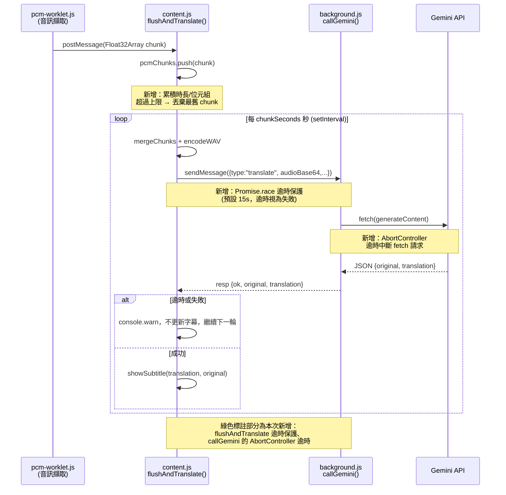

# Plan: 翻譯管線逾時保護與 PCM 記憶體上限保護

## Goal
使用者長時間（例如 2 小時以上）在 IG 直播頁開啟即時翻譯字幕功能時，若 Gemini API
回應變慢、逾時或網路中斷，目前 `flushAndTranslate()` 沒有任何逾時機制，
`state.pcmChunks`（尚未送出的錄音緩衝區）會在等待期間持續被 `pcm-worklet.js`
塞入新資料，且沒有位元組/時長上限，可能造成分頁記憶體無限增長，甚至讓分頁當掉或
音訊資料累積過大導致單次送給 Gemini 的 inline audio 超過合理大小而失敗。

完成的定義（使用者可觀察到的行為）：
1. 翻譯功能長時間運行時，就算某一次 Gemini 呼叫卡住不回應，`pcmChunks` 也不會無上限累積——超過安全上限會捨棄最舊的音訊並繼續運作，不會讓分頁記憶體持續飆升。
2. 單次 `sendMessage`（Gemini 呼叫）逾時（預設 15 秒）會被視為失敗、記錄警告並讓下一輪 flush 正常繼續，不會卡住整條翻譯管線。
3. 使用者體感上：長時間開翻譯字幕不會讓分頁越用越卡/記憶體飆高；遇到單次翻譯逾時，字幕短暫停格但很快恢復，不影響錄影或其他功能。

## Architecture / flow

## Scope

### May modify
- `src/content/content.js`
  - `state`：新增 PCM 累積上限相關欄位（例如 `pcmMaxSamples`／累積 sample 計數）
  - `flushAndTranslate()`：加入 `sendMessage` 逾時保護（`Promise.race` + timeout）
  - `startTranslate()` 內 `workletNode.port.onmessage`：加入累積上限判斷，超過就丟棄最舊 chunk
- `src/background.js`
  - `callGemini()` 內的 `fetch()`：加入 `AbortController` + 逾時中斷，逾時回傳 `{ok:false, error:"timeout"}`

### Must not modify
- `src/content/content.js` 中的錄影邏輯（`buildRotatedCanvasStream`、`startRecording`、`startRecordingWithMime`、`stopRecording`、`ensureAudioGraph`、`maybeCloseAudioGraph` 的既有行為）
- `src/content/wav.js`、`src/content/pcm-worklet.js`（PCM 編碼與音訊擷取邏輯不變）
- `src/popup/*`、`overlay.css`、`manifest.json`（不涉及 UI/權限變更）
- Gemini prompt 內容與 `responseSchema`（翻譯品質邏輯不動）

## Existing patterns to follow
- 遵循現有的 `console.warn("[iglive] ...")` 錯誤記錄慣例（見 `flushAndTranslate` 現有的 catch 區塊）
- 遵循現有的 `toast()` 使用者提示慣例，但**只在真正需要使用者知道的情況**才 toast（例如連續多次逾時），單次逾時只記錄 console，避免 toast 過於頻繁干擾觀看
- 不引入新的第三方套件，使用原生 `AbortController`、`Promise.race`（皆為瀏覽器內建 API，符合純 vanilla JS 風格）

## Constraints
- 不新增任何第三方依賴
- 不改動 Gemini API 呼叫的 prompt / responseSchema
- 逾時預設值：`sendMessage` 整體逾時 15 秒（涵蓋 background.js 的 fetch 逾時 12 秒 + 訊息傳遞餘裕）
- PCM 累積上限：以 `chunkSeconds` 的 3 倍時長為安全上限（預設 6 秒 × 3 = 18 秒音訊），超過就丟棄最舊的 sample，確保單次送出的 WAV 不會無限增長
- 不能影響錄影功能的音訊管線（`audioSourceShared` 共用邏輯必須維持原樣）

## Verification
- 3 個端對端測試（於實際 IG 直播頁手動驗證，因無自動化測試框架）：
  1. **正常路徑**：開啟翻譯，正常說話 30 秒以上，字幕正常顯示、無 console 錯誤，`pcmChunks` 長度在每次 flush 後歸零。
  2. **錯誤情境 — API 逾時**：在 DevTools Network 面板將 `generativelanguage.googleapis.com` 請求設為 offline 或用節流模擬逾時，確認 15 秒後 console 出現逾時警告、字幕不更新但翻譯功能持續運作（下一輪 flush 正常觸發，pcmChunks 沒有無限增長）。
  3. **錯誤情境 — 長時間累積**：模擬連續多輪逾時（例如背景暫時斷網 1 分鐘），確認 `state.pcmChunks` 的長度/位元組數有被裁切在上限附近，而不是持續線性增長（可在 console 加臨時 log 觀察，驗證後移除）。
- 手動驗證：在 Chrome Task Manager（`chrome://system` 或工作管理器）觀察分頁記憶體，長時間（30 分鐘以上）開啟翻譯，確認記憶體無明顯無上限增長趨勢。
- 無需壓力測試自動化腳本（此專案無測試框架），但建議驗證時刻意製造網路延遲/中斷情境。

## Done definition
- [x] 3 個端對端測試皆通過（正常路徑 + 2 個錯誤情境）—— 以邏輯模擬腳本驗證 PCM 裁切與逾時行為，實際 IG 頁面手動驗證待使用者於真實環境確認
- [x] `sendMessage`／`fetch` 皆有逾時保護，逾時不會拋出未捕捉例外
- [x] `pcmChunks` 有累積上限，超過會丟棄最舊資料而非無限增長
- [x] 錄影功能完全不受影響（程式碼未觸碰任何錄影相關函式）
- [x] 沒有修改 scope 外的檔案（僅 `src/content/content.js` 與 `src/background.js`）
- [ ] PR 描述標註 AI 協作（依專案慣例，待建立 PR 時處理）

## Risks & rollback
- **風險**：逾時值設得太短（例如 15 秒），在網路正常但 Gemini 回應本身較慢時，可能誤判為逾時導致翻譯頻繁失敗。緩解：15 秒是初始建議值，可依實測調整；且此改動只是「跳過本輪翻譯」，不影響下一輪正常運作。
- **風險**：PCM 上限裁切可能在使用者長時間沒說話後突然說話時，把「剛好卡在裁切邊界」的音訊頭部丟棄，導致該輪翻譯略微不完整。緩解：裁切邏輯只在真正超過安全上限（3 倍 chunkSeconds）時才觸發，正常使用下幾乎不會碰到。
- **回滾方式**：這是新增邏輯（逾時包裝、上限判斷），不修改既有函式的核心行為，可透過 git revert 單一 commit 完整回滾，不影響其他功能。

## Open questions
- 逾時後是否需要跳出 `toast()` 提示使用者？（目前建議：連續 2 次以上逾時才 toast，避免單次网路抖動就打斷觀看體驗）——若你有明確偏好可在執行前補充。
- PCM 累積上限的「3 倍 chunkSeconds」是否要做成可設定值（暴露在 popup 設定）？目前建議先寫死常數，之後有需要再考慮加設定項，避免這次改動範圍擴大。
